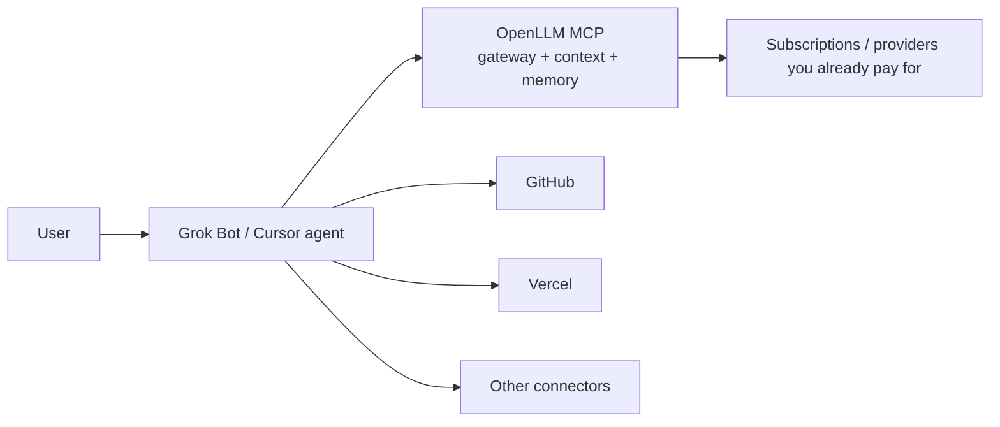

# OpenLLM Orchestrator

**Grok Bot (or any Cursor agent) plans and coordinates. OpenLLM is the model fabric** — one gateway plus `openllm mcp` across subscriptions and providers you already pay for — so the same agent can run dashboard-style account ops and real development tasks without pretending OpenLLM is GitHub or Vercel.

Install this plugin (or clone the repo) when you want Cursor/Grok Bot to manage [OpenLLM](https://openllm.sh) via MCP and to execute coding work through the gateway, while GitHub, Vercel, and other connectors stay on the orchestrator.

Plugin id: `openllm-orchestrator` · Author: MindDragonLabs · License: MIT  
Repo: [https://github.com/MindDragonLabs/grok-openllm-orchestrator](https://github.com/MindDragonLabs/grok-openllm-orchestrator)

## Architecture

```text
Orchestrator  =  Grok Bot / Cursor agent   →  plan, tools, approvals, code, GitHub/Vercel/…
Model fabric  =  OpenLLM gateway + MCP     →  models, completions, account API, context, memory
```



Details: [docs/architecture.md](docs/architecture.md). Grok Bot owners: [docs/grok-bot.md](docs/grok-bot.md).

## Install (Cursor)

### Marketplace (when listed)

1. Open **Customize** → Plugins / Marketplace.
2. Install **OpenLLM Orchestrator** (`openllm-orchestrator`).
3. Set variables under **Plugins → Configure** (see below).
4. Confirm the `openllm` MCP server is running.

Submit/update listing: [cursor.com/marketplace/publish](https://cursor.com/marketplace/publish).

### Clone this repository

```sh
git clone https://github.com/MindDragonLabs/grok-openllm-orchestrator
```

Use it as a project, as a team marketplace source, or copy the tree.

### Local plugin (development)

1. Copy this repo to `~/.cursor/plugins/local/openllm-orchestrator` (the folder must live **inside** `~/.cursor/plugins/local`; Cursor skips symlinks that point elsewhere).
2. Restart Cursor or **Developer: Reload Window**.
3. Open Customize and confirm skills, the orchestrator rule, commands, and the `openllm` MCP server.

On Teams/Enterprise, local plugin imports may be admin-gated.

## Prerequisites

1. An [OpenLLM](https://openllm.sh) account.
2. The **OpenLLM CLI** (provides `openllm mcp`). Review, then:

   ```sh
   curl -fsSL "https://openllm.sh/api/setup/cli/install.sh" | bash
   openllm version
   ```

   **Dashboard one-click:** installing OpenLLM's plugin from the gateway dashboard also drops the CLI, but that path is sandboxed — run `~/.openllm/bin/openllm setup` once.

   Upstream CLI: [github.com/openllmsh/cli](https://github.com/openllmsh/cli).

3. An API key from the OpenLLM dashboard (`sk-llm` / API key). Put it in plugin variables, not in git.

## Configure variables

Declared in `.cursor-plugin/plugin.json`, substituted into `mcp.json`:

| Variable | Required | Default | Purpose |
| --- | --- | --- | --- |
| `OPENLLM_API_KEY` | yes | — | Dashboard API key |
| `OPENLLM_CLOUD_ORIGIN` | no | `https://openllm.sh` | Gateway origin (host origin, not a `/v1` path) |

The CLI also reads `~/.openllm/.env` from daemon pairing. Marketplace/Cloud Agent installs should still set plugin variables so `${OPENLLM_API_KEY}` resolves.

Shipped MCP server (stdio only):

```json
{
  "mcpServers": {
    "openllm": {
      "command": "openllm",
      "args": ["mcp"],
      "env": {
        "OPENLLM_API_KEY": "${OPENLLM_API_KEY}",
        "OPENLLM_CLOUD_ORIGIN": "${OPENLLM_CLOUD_ORIGIN}"
      }
    }
  }
}
```

### Alternate connection paths

- **OpenLLM dashboard plugin** — installs the CLI; then PATH setup as above.
- **Remote MCP / SSE** — only if the dashboard shows a URL. Add as **custom MCP** with `Authorization: Bearer <OPENLLM_API_KEY>`. This repo does **not** ship a guessed remote URL.
- **npm launcher** (not the default `mcp.json`): `npx -y @openllmsh/npm mcp`.

MCP groups you should expect (names can shift; trust the live list): native gateway API (one tool per `/api/swagger` operation), code/docs search (`openllm-context` / `claude-context`), memory (`openllm-memory` / `supermemory`).

## How Grok Bot users use this

1. Keep GitHub, Vercel, and other connectors.
2. Add OpenLLM as a **custom MCP** in Grok Bot chat (`openllm mcp` or `npx -y @openllmsh/npm mcp`, plus env vars — or a dashboard remote URL if one exists). Template share does **not** include the next owner's MCP.
3. Install this plugin or copy `skills/*/SKILL.md` into Grok Bot skills.
4. Ask the bot to list OpenLLM tools, then pick dashboard mode or a dev task.

Copy-paste blocks: [docs/grok-bot.md](docs/grok-bot.md). Skill: `grok-bot-orchestrator`.

Commands in Cursor: `/setup-openllm`, `/openllm-dev-task`.

## In scope / out of scope

**In scope**

- Teaching the orchestrator vs model-fabric split
- Connecting official `openllm mcp`
- Dashboard-like account work through live MCP tools
- Development tasks: catalog → context → orchestrator coding tools → optional gateway completions hop
- Grok Bot custom-connector playbook

**Out of scope**

- Replacing GitHub, Vercel, or other product MCP servers
- Shipping API keys, remote MCP URLs we do not control, or a second application
- Inventing OpenLLM tool names (always discover from the connected server)
- Claiming OpenLLM stores or deploys your git repo

## Repo layout

```text
.cursor-plugin/plugin.json
mcp.json
skills/          getting-started, openllm-connect, openllm-dashboard,
                 openllm-dev-task, grok-bot-orchestrator
rules/           openllm-orchestrator.mdc
commands/        setup-openllm, openllm-dev-task
docs/            architecture.md, grok-bot.md
assets/logo.svg
```

## Links

- OpenLLM: [https://openllm.sh](https://openllm.sh)
- OpenLLM CLI: [https://github.com/openllmsh/cli](https://github.com/openllmsh/cli)
- This plugin: [https://github.com/MindDragonLabs/grok-openllm-orchestrator](https://github.com/MindDragonLabs/grok-openllm-orchestrator)
- Cursor plugins reference: [https://cursor.com/docs/reference/plugins](https://cursor.com/docs/reference/plugins)
- Publish: [https://cursor.com/marketplace/publish](https://cursor.com/marketplace/publish)
