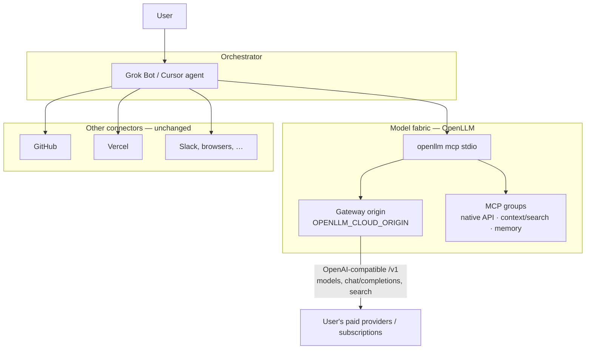

# Architecture

Grok Bot or any Cursor agent is the **orchestrator**. OpenLLM is the **model fabric** (hosted gateway + `openllm mcp`). Other connectors stay responsible for repos, deploys, and the rest of the product surface.

## Roles

```text
Orchestrator  =  Grok Bot / Cursor agent
                 plans, tool choice, approvals, editor/shell, GitHub/Vercel/…

Model fabric  =  OpenLLM gateway + `openllm mcp`
                 routes inference across subscriptions/providers the user already pays for
                 MCP: native API + code/docs search + memory
```

OpenLLM does **not** replace GitHub, Vercel, or Cursor's coding tools. It supplies models and gateway MCP tools.

## Diagram



Cursor loads this plugin's `mcp.json` and substitutes `${OPENLLM_API_KEY}` / `${OPENLLM_CLOUD_ORIGIN}` from Plugins → Configure. Grok Bot needs the same server added as a **custom MCP** (template share does not carry another owner's connector). See [grok-bot.md](./grok-bot.md).

## Two operating modes

| Mode | Orchestrator does | OpenLLM does |
| --- | --- | --- |
| **Dashboard** | Chooses read/mutate tools, explains results, asks approval for writes | Account API via MCP (usage, models, keys/devices, providers, config) |
| **Development execution** | Clarifies goal, edits code, tests, git, PRs, deploys | Catalog + optional completions hop + context/memory tools |

Browser on [openllm.sh](https://openllm.sh) is a **fallback** when MCP/API lacks a surface.

## MCP groups (discover live names)

The CLI's unified server (`openllm mcp`) exposes groups. Upstream currently documents native API plus code/docs search and memory; labels have appeared as `openllm-context` / `claude-context` and `openllm-memory` / `supermemory`. Skills in this plugin talk about **jobs**, not frozen function names.

Native tools are generated from the same OpenAPI document the gateway serves at `/api/swagger` (also `openllm api --spec`). Useful landmarks:

- Inference: `/v1/models`, `/v1/chat/completions`, `/v1/messages`, `/v1/responses`, `/v1/search`
- Account: `/stats`, `/keys`, `/credentials`, `/providers/custom`, `/config/user`, `/billing`, `/user`

## Trust boundaries

- API keys stay in plugin variables, MCP env, or `~/.openllm/.env` — never in git.
- Provider credentials live in OpenLLM's vault model (see OpenLLM's own security docs). This plugin does not proxy them.
- Repo secrets and deploy tokens stay on GitHub/Vercel (or whatever the project already uses).

## References

- OpenLLM: [https://openllm.sh](https://openllm.sh)
- CLI / MCP: [https://github.com/openllmsh/cli](https://github.com/openllmsh/cli)
- This plugin: [https://github.com/MindDragonLabs/grok-openllm-orchestrator](https://github.com/MindDragonLabs/grok-openllm-orchestrator)
- Cursor plugins: [https://cursor.com/docs/reference/plugins](https://cursor.com/docs/reference/plugins)
